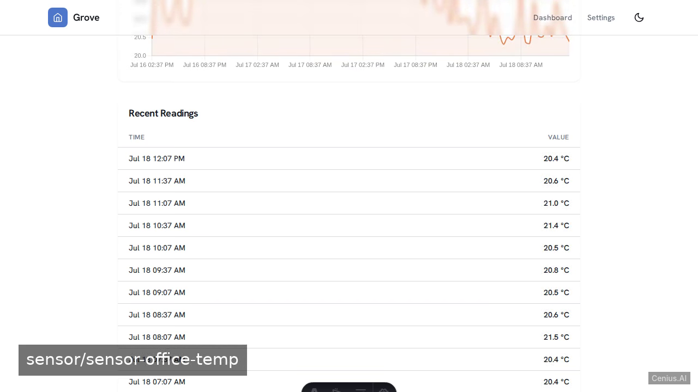
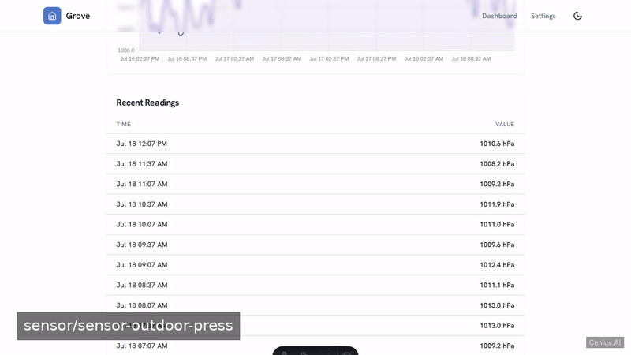
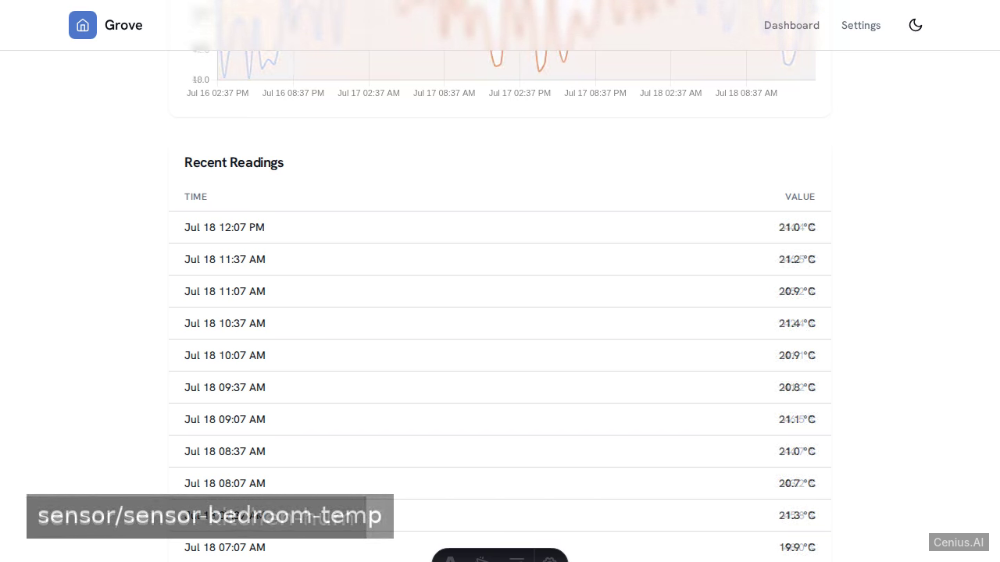
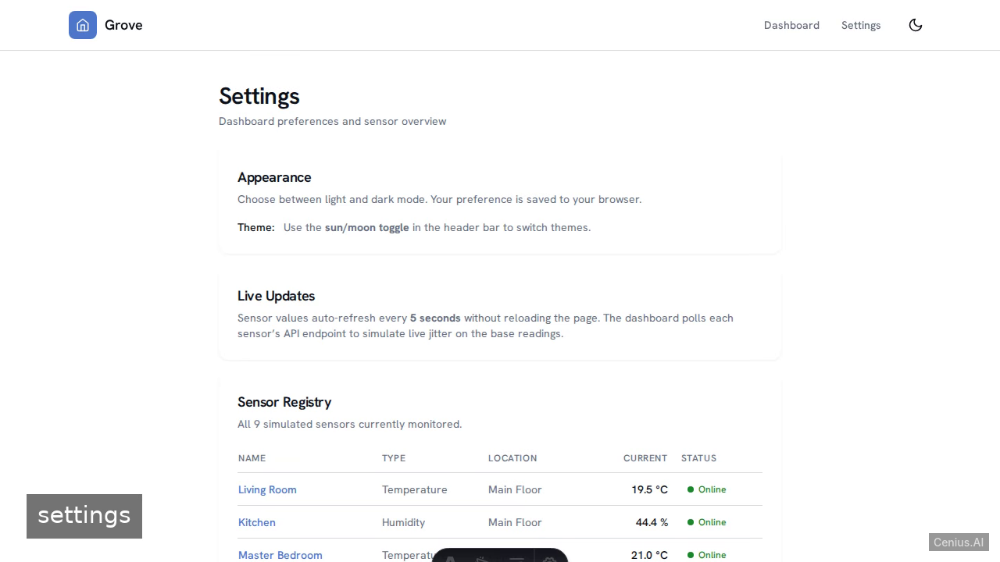

# Grove — Smart-Home Dashboard — production-ready Astro monitoring dashboard starter

If you want a self-hosted monitoring dashboard without the vendor lock-in, **Grove — Smart-Home Dashboard** is ready to run. Built with Astro and Apache-2.0-licensed, Grove — Smart-Home Dashboard ships complete — one clone, one install command. A read‑only smart‑home dashboard built with Astro + TypeScript that displays live‑like sensor readings for temperature, humidity, lights, energy usage, motion, and locks. [Open Grove — Smart-Home Dashboard on cenius.ai](https://cenius.ai/marketplace/p/grove-smart-home-dashboard?ref=gh&utm_campaign=grove-smart-home-dashboard-astro) to customise it without touching a line of Grove — Smart-Home Dashboard code.


[](LICENSE)  [](https://cenius.ai)

[](https://cenius.ai/marketplace/p/grove-smart-home-dashboard?ref=gh&utm_campaign=grove-smart-home-dashboard-astro)

> **▶ [Open & edit in cenius.ai](https://cenius.ai/marketplace/p/grove-smart-home-dashboard?ref=gh&utm_campaign=grove-smart-home-dashboard-astro)** — one click to an editable workspace: describe changes in plain English, get an instant preview, one-click deploy and host. Modifications made on the platform come with full rebrand & relicense rights.

_Local clone? See [Quick start](#quick-start) below. cenius.ai is the zero-setup path._

## Demo





▶ **[Full demo walkthrough](https://cenius.ai/marketplace/p/grove-smart-home-dashboard?ref=gh&utm_campaign=grove-smart-home-dashboard-astro)** — watch it on the project page · [download MP4](.github/media/demo.mp4)

## Screenshots

  

## Quick start

```bash
./install.sh   # installs dependencies + seeds demo data
```

See [`INSTALL.md`](INSTALL.md) for full setup and usage instructions.

## Architecture

Everything runs out of the box: a Astro codebase (34 files). `./install.sh` gets you from a fresh clone to a running instance with sample data in a single step. Top-level layout: `public/`, `src/`. Step-by-step setup guide: [`INSTALL.md`](INSTALL.md).

## Features

- Dashboard overview with sensor cards
- Sensor detail page with historical chart
- Light/dark theme toggle
- Responsive design
- Simulated live updates
- Multi‑page navigation

## Usage guide

### Dashboard (`/`)

The home screen displays a grid of sensor cards. Each card shows:

- **Sensor name** and **location**
- **Current value** with unit (e.g. `21.5 °C`)
- **Status dot** — green (online), amber (warning), grey (offline)
- **Last updated** timestamp

The values **update every 5 seconds** automatically — no page reload needed. Each card polls the API for a jittered reading, simulating real sensor drift.

Click any card to open its detail page.

#### Keyboard navigation

- **Tab** through cards and navigation links
- **Enter** to follow a link / open a detail page
- **Focus ring** is visible on every interactive element

### Sensor Detail (`/sensor/[id]`)

Each sensor detail page includes:

1. **Header card** — sensor icon, name, location, type, and online status
2. **Stat grid** — current, average, min, and max values over 48 hours
3. **History chart** — a filled line chart (Chart.js) of all 96 readings
4. **Recent readings table** — the last 12 data points in tabular form

Use the **"Back to Dashboard"** link or the header nav to return.

### Settings (`/settings`)

The settings page provides:

- **Appearance** — theme toggle instructions (the toggle lives in the header, not here)
- **Live Updates** — explains the 5-second polling interval
- **Sensor Registry** — a table of all simulated sensors with links, types, locations, current values, and status
- **About** — project background and tech stack

### Theme Toggle

The **sun/moon icon** in the top-right header switches between light and dark mode.

_Full guide: [`USAGE.md`](USAGE.md)_

## FAQ

### What does it take to self-host Grove — Smart-Home Dashboard?

Everything you need ships in this repo: clone it, run `./install.sh` to install dependencies and seed demo data, then follow [`INSTALL.md`](INSTALL.md) to start it. No external services required.

### Is Grove — Smart-Home Dashboard free for commercial use?

The code is under the Apache-2.0 license, which allows commercial use without restriction. You can build, sell, and deploy it freely. Full text: [LICENSE](LICENSE).

### What technologies are in Grove — Smart-Home Dashboard's stack?

Astro end-to-end. Every file you need to run the app is here in this repository — code, configuration, seed data. Highlights include sensor detail page with historical chart.

### Is there a no-code way to modify Grove — Smart-Home Dashboard?

Describe what you want changed on [cenius.ai](https://cenius.ai/marketplace/p/grove-smart-home-dashboard?ref=gh&utm_campaign=grove-smart-home-dashboard-astro) — no code editing needed; the platform produces a fresh build you can download and deploy.

### Is white-labeling Grove — Smart-Home Dashboard allowed?

White-labeling is supported: fork the MIT-licensed source and rebrand it yourself, or use [cenius.ai](https://cenius.ai/marketplace/p/grove-smart-home-dashboard?ref=gh&utm_campaign=grove-smart-home-dashboard-astro) to make changes in a guided workspace — platform modifications come with full rebrand rights.

## License & rebranding

Released under the [Apache License 2.0](LICENSE) (© 2026 Cenius AI) — free for personal and commercial use. The Cenius name/logo are trademarks (see NOTICE).

**Need a customized version?** [Remix this app on cenius.ai](https://cenius.ai/marketplace/p/grove-smart-home-dashboard?ref=gh&utm_campaign=grove-smart-home-dashboard-astro) — modifications made on the platform come with **full rebrand & relicense rights** over your derivative.

## Built with cenius.ai

This entire application — code, design, seeded demo data — was generated on **[cenius.ai](https://cenius.ai)** from a plain-English description.

- 🚀 [Build your own app on cenius.ai](https://cenius.ai)
- 🎛️ [Remix Grove — Smart-Home Dashboard on the marketplace](https://cenius.ai/marketplace/p/grove-smart-home-dashboard?ref=gh&utm_campaign=grove-smart-home-dashboard-astro) — open it in a workspace, prompt for changes, and ship your own version.

More open-source apps: [the Cenius-ai catalog](https://github.com/Cenius-ai) · [showcase index](https://github.com/Cenius-ai/showcase)
